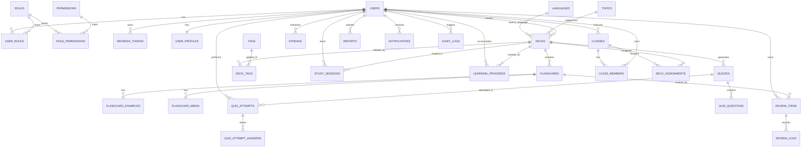

# ERD Backend Flashcard Learning

## Tong quan domain

He thong duoc chia thanh cac nhom du lieu chinh:

1. Identity & Access
2. Learning Content
3. Learning Engine
4. Assessment
5. Classroom
6. Administration

## ERD muc logic

## Bang du lieu de xuat

### 1. Identity & Access

#### `users`
- `id` BIGSERIAL PK
- `email` VARCHAR(255) UNIQUE NOT NULL
- `username` VARCHAR(100) UNIQUE NOT NULL
- `password_hash` VARCHAR(255) NOT NULL
- `status` VARCHAR(30) NOT NULL
- `created_at` TIMESTAMP NOT NULL
- `updated_at` TIMESTAMP NOT NULL

#### `user_profiles`
- `id` BIGSERIAL PK
- `user_id` BIGINT UNIQUE FK -> users.id
- `full_name` VARCHAR(150)
- `avatar_url` VARCHAR(500)
- `native_language_code` VARCHAR(10)
- `target_language_code` VARCHAR(10)
- `timezone` VARCHAR(50)
- `bio` TEXT

#### `roles`
- `id` BIGSERIAL PK
- `name` VARCHAR(50) UNIQUE NOT NULL
- `description` VARCHAR(255)

#### `permissions`
- `id` BIGSERIAL PK
- `code` VARCHAR(100) UNIQUE NOT NULL
- `description` VARCHAR(255)

#### `user_roles`
- `user_id` BIGINT FK -> users.id
- `role_id` BIGINT FK -> roles.id
- PK (`user_id`, `role_id`)

#### `role_permissions`
- `role_id` BIGINT FK -> roles.id
- `permission_id` BIGINT FK -> permissions.id
- PK (`role_id`, `permission_id`)

#### `refresh_tokens`
- `id` BIGSERIAL PK
- `user_id` BIGINT FK -> users.id
- `token` VARCHAR(500) UNIQUE NOT NULL
- `expires_at` TIMESTAMP NOT NULL
- `revoked` BOOLEAN NOT NULL DEFAULT FALSE
- `created_at` TIMESTAMP NOT NULL

### 2. Learning Content

#### `languages`
- `id` BIGSERIAL PK
- `code` VARCHAR(10) UNIQUE NOT NULL
- `name` VARCHAR(100) NOT NULL
- `active` BOOLEAN NOT NULL DEFAULT TRUE

#### `topics`
- `id` BIGSERIAL PK
- `name` VARCHAR(100) UNIQUE NOT NULL
- `description` VARCHAR(255)
- `active` BOOLEAN NOT NULL DEFAULT TRUE

#### `tags`
- `id` BIGSERIAL PK
- `name` VARCHAR(50) UNIQUE NOT NULL

#### `decks`
- `id` BIGSERIAL PK
- `title` VARCHAR(150) NOT NULL
- `description` TEXT
- `source_language_id` BIGINT FK -> languages.id
- `target_language_id` BIGINT FK -> languages.id
- `topic_id` BIGINT FK -> topics.id
- `visibility` VARCHAR(30) NOT NULL
- `status` VARCHAR(30) NOT NULL
- `created_by` BIGINT FK -> users.id
- `approved_by` BIGINT FK -> users.id NULL
- `created_at` TIMESTAMP NOT NULL
- `updated_at` TIMESTAMP NOT NULL

#### `deck_tags`
- `deck_id` BIGINT FK -> decks.id
- `tag_id` BIGINT FK -> tags.id
- PK (`deck_id`, `tag_id`)

#### `flashcards`
- `id` BIGSERIAL PK
- `deck_id` BIGINT FK -> decks.id
- `front_text` TEXT NOT NULL
- `back_text` TEXT NOT NULL
- `pronunciation` VARCHAR(255)
- `example_sentence` TEXT
- `note` TEXT
- `difficulty_level` VARCHAR(30)
- `card_order` INT NOT NULL DEFAULT 0
- `active` BOOLEAN NOT NULL DEFAULT TRUE
- `created_at` TIMESTAMP NOT NULL
- `updated_at` TIMESTAMP NOT NULL

#### `flashcard_examples`
- `id` BIGSERIAL PK
- `flashcard_id` BIGINT FK -> flashcards.id
- `example_text` TEXT NOT NULL
- `translation_text` TEXT

#### `flashcard_media`
- `id` BIGSERIAL PK
- `flashcard_id` BIGINT FK -> flashcards.id
- `media_type` VARCHAR(30) NOT NULL
- `media_url` VARCHAR(500) NOT NULL

### 3. Learning Engine

#### `study_sessions`
- `id` BIGSERIAL PK
- `user_id` BIGINT FK -> users.id
- `deck_id` BIGINT FK -> decks.id
- `started_at` TIMESTAMP NOT NULL
- `ended_at` TIMESTAMP NULL
- `total_cards` INT NOT NULL DEFAULT 0
- `reviewed_cards` INT NOT NULL DEFAULT 0
- `status` VARCHAR(30) NOT NULL

#### `review_items`
- `id` BIGSERIAL PK
- `user_id` BIGINT FK -> users.id
- `flashcard_id` BIGINT FK -> flashcards.id
- `ease_factor` DECIMAL(4,2) NOT NULL DEFAULT 2.50
- `interval_days` INT NOT NULL DEFAULT 0
- `repetition_count` INT NOT NULL DEFAULT 0
- `mastery_level` VARCHAR(30) NOT NULL DEFAULT 'NEW'
- `last_review_at` TIMESTAMP NULL
- `next_review_at` TIMESTAMP NULL
- UNIQUE (`user_id`, `flashcard_id`)

#### `review_logs`
- `id` BIGSERIAL PK
- `review_item_id` BIGINT FK -> review_items.id
- `study_session_id` BIGINT FK -> study_sessions.id NULL
- `quality_score` INT NOT NULL
- `response_time_ms` BIGINT NULL
- `reviewed_at` TIMESTAMP NOT NULL

#### `learning_progress`
- `id` BIGSERIAL PK
- `user_id` BIGINT FK -> users.id
- `deck_id` BIGINT FK -> decks.id
- `learned_cards` INT NOT NULL DEFAULT 0
- `mastered_cards` INT NOT NULL DEFAULT 0
- `completion_rate` DECIMAL(5,2) NOT NULL DEFAULT 0
- `last_studied_at` TIMESTAMP NULL
- UNIQUE (`user_id`, `deck_id`)

#### `streaks`
- `id` BIGSERIAL PK
- `user_id` BIGINT UNIQUE FK -> users.id
- `current_streak_days` INT NOT NULL DEFAULT 0
- `best_streak_days` INT NOT NULL DEFAULT 0
- `last_study_date` DATE NULL

### 4. Assessment

#### `quizzes`
- `id` BIGSERIAL PK
- `deck_id` BIGINT FK -> decks.id
- `title` VARCHAR(150) NOT NULL
- `question_count` INT NOT NULL
- `created_by` BIGINT FK -> users.id
- `created_at` TIMESTAMP NOT NULL

#### `quiz_questions`
- `id` BIGSERIAL PK
- `quiz_id` BIGINT FK -> quizzes.id
- `flashcard_id` BIGINT FK -> flashcards.id
- `question_text` TEXT NOT NULL
- `correct_answer` TEXT NOT NULL
- `question_type` VARCHAR(30) NOT NULL

#### `quiz_attempts`
- `id` BIGSERIAL PK
- `quiz_id` BIGINT FK -> quizzes.id
- `user_id` BIGINT FK -> users.id
- `score` DECIMAL(5,2) NOT NULL DEFAULT 0
- `started_at` TIMESTAMP NOT NULL
- `submitted_at` TIMESTAMP NULL

#### `quiz_attempt_answers`
- `id` BIGSERIAL PK
- `attempt_id` BIGINT FK -> quiz_attempts.id
- `question_id` BIGINT FK -> quiz_questions.id
- `submitted_answer` TEXT
- `correct` BOOLEAN NOT NULL DEFAULT FALSE

### 5. Classroom

#### `classes`
- `id` BIGSERIAL PK
- `name` VARCHAR(150) NOT NULL
- `description` TEXT
- `instructor_id` BIGINT FK -> users.id
- `status` VARCHAR(30) NOT NULL
- `created_at` TIMESTAMP NOT NULL

#### `class_members`
- `class_id` BIGINT FK -> classes.id
- `user_id` BIGINT FK -> users.id
- `joined_at` TIMESTAMP NOT NULL
- PK (`class_id`, `user_id`)

#### `deck_assignments`
- `id` BIGSERIAL PK
- `class_id` BIGINT FK -> classes.id
- `deck_id` BIGINT FK -> decks.id
- `assigned_by` BIGINT FK -> users.id
- `assigned_at` TIMESTAMP NOT NULL
- `due_at` TIMESTAMP NULL

### 6. Administration

#### `notifications`
- `id` BIGSERIAL PK
- `user_id` BIGINT FK -> users.id
- `title` VARCHAR(150) NOT NULL
- `content` TEXT NOT NULL
- `read` BOOLEAN NOT NULL DEFAULT FALSE
- `created_at` TIMESTAMP NOT NULL

#### `reports`
- `id` BIGSERIAL PK
- `reporter_id` BIGINT FK -> users.id
- `target_type` VARCHAR(30) NOT NULL
- `target_id` BIGINT NOT NULL
- `reason` TEXT NOT NULL
- `status` VARCHAR(30) NOT NULL
- `created_at` TIMESTAMP NOT NULL

#### `audit_logs`
- `id` BIGSERIAL PK
- `actor_id` BIGINT FK -> users.id
- `action` VARCHAR(100) NOT NULL
- `resource_type` VARCHAR(50) NOT NULL
- `resource_id` BIGINT NULL
- `details` TEXT NULL
- `created_at` TIMESTAMP NOT NULL

## Rang buoc nghiep vu quan trong

1. Moi `review_item` la duy nhat theo cap `user_id + flashcard_id`.
2. `deck` co the thuoc mot chu de, mot nguon ngon ngu va mot dich ngon ngu.
3. `flashcard` chi thuoc mot `deck`.
4. `learning_progress` duy nhat theo cap `user_id + deck_id`.
5. `class_members` va `deck_tags` la cac bang many-to-many.
6. Nen uu tien soft delete cho `users`, `decks`, `flashcards` neu can giu lich su.
