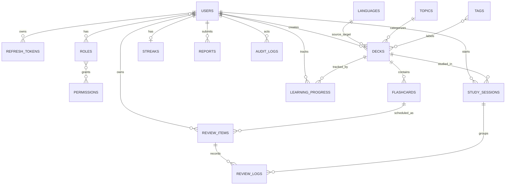

# MongoDB Collection Map

Tai lieu nay mo ta quan he du lieu o muc collection cho MVP MongoDB. Project hien tai dung collection/document design thay cho relational schema.

## Tong quan collection

## Identity

### `users`

- `_id`: Long
- `email`: String, unique
- `username`: String, unique
- `password_hash`: String
- `status`: `ACTIVE`, `LOCKED`, `DISABLED`
- `profile`: embedded object
- `roles`: DBRef set den `roles`
- `created_at`, `updated_at`, `deleted_at`

### `roles`

- `_id`: Long
- `name`: String, unique
- `description`: String
- `permissions`: DBRef set den `permissions`

### `permissions`

- `_id`: Long
- `code`: String, unique
- `description`: String

## Auth

### `refresh_tokens`

- `_id`: Long
- `user`: DBRef den `users`
- `token_hash`: String, unique
- `expires_at`: DateTime
- `revoked`: Boolean
- `revoked_at`: DateTime nullable
- `created_at`: DateTime

## Content

### `languages`

- `_id`: Long
- `code`: String, unique
- `name`: String
- `active`: Boolean

### `topics`

- `_id`: Long
- `name`: String, unique
- `description`: String
- `active`: Boolean

### `tags`

- `_id`: Long
- `name`: String, unique

### `decks`

- `_id`: Long
- `title`: String
- `description`: String
- `source_language`: DBRef den `languages`
- `target_language`: DBRef den `languages`
- `topic`: DBRef den `topics`
- `tags`: DBRef set den `tags`
- `visibility`: `PRIVATE`, `PUBLIC`
- `status`: `DRAFT`, `PENDING`, `APPROVED`, `REJECTED`
- `created_by`: DBRef den `users`
- `approved_by`: DBRef den `users`, nullable
- `approved_at`: DateTime nullable
- `rejection_reason`: String nullable
- `created_at`, `updated_at`, `deleted_at`

### `flashcards`

- `_id`: Long
- `deck`: DBRef den `decks`
- `front_text`: String
- `back_text`: String
- `pronunciation`: String
- `example_sentence`: String
- `note`: String
- `difficulty_level`: String
- `card_order`: Number
- `active`: Boolean
- `created_at`, `updated_at`, `deleted_at`

## Learning

### `study_sessions`

- `_id`: Long
- `user`: DBRef den `users`
- `deck`: DBRef den `decks`
- `started_at`, `ended_at`
- `total_cards`, `reviewed_cards`
- `status`: String

### `review_items`

- `_id`: Long
- `user`: DBRef den `users`
- `flashcard`: DBRef den `flashcards`
- `ease_factor`, `interval_days`, `repetition_count`
- `mastery_level`
- `last_review_at`, `next_review_at`
- `created_at`, `updated_at`

### `review_logs`

- `_id`: Long
- `review_item`: DBRef den `review_items`
- `study_session`: DBRef den `study_sessions`, nullable
- `quality_score`
- `rating`: `AGAIN`, `HARD`, `GOOD`, `EASY`
- `response_time_ms`
- `reviewed_at`

### `learning_progress`

- `_id`: Long
- `user`: DBRef den `users`
- `deck`: DBRef den `decks`
- `learned_cards`, `mastered_cards`
- `completion_rate`
- `last_studied_at`, `updated_at`

### `streaks`

- `_id`: Long
- `user`: DBRef den `users`
- `current_streak_days`, `best_streak_days`
- `last_study_date`, `updated_at`

## Admin

### `reports`

- `_id`: Long
- `reporter`: DBRef den `users`
- `target_type`, `target_id`
- `reason`, `status`
- `created_at`, `resolved_at`

### `audit_logs`

- `_id`: Long
- `actor`: DBRef den `users`
- `action`, `resource_type`, `resource_id`, `details`
- `created_at`

## Infra

### `database_sequences`

- `_id`: sequence name
- `seq`: current Long value

Collection nay giu auto-increment-like sequence cho domain document Long IDs.

## Ghi chu MVP

1. Assessment va Classroom nam ngoai MVP hien tai, chua tao collection.
2. Media rieng cho flashcard chua implement thanh collection rieng; URL/media co the bo sung sau.
3. Nhung rule unique logic nhu `(user, flashcard)` va `(user, deck)` can duoc bao ve bang service logic va index neu mo rong.
